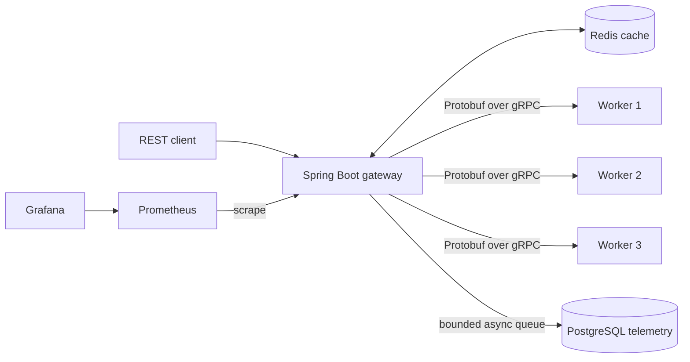

# Inference Gateway

A Java 21 inference infrastructure project: a Spring Boot REST gateway routes requests to three independent gRPC workers, caches repeated results in Redis, records request telemetry in PostgreSQL, and exports Prometheus metrics to Grafana. The workers use a replaceable `InferenceEngine` implementation; the included engine simulates latency and returns a mock answer. No model API or chatbot UI is involved.

## Architecture



The gateway never generates output itself. It validates the REST request, checks Redis, chooses a healthy worker, and sends the request through the [shared protobuf contract](proto/src/main/proto/inference.proto). The same request ID appears in the REST response, gRPC request, worker log, gateway log, and PostgreSQL telemetry row.

### Repository layout

| Path | Responsibility |
| --- | --- |
| `proto/` | `Infer` and `Health` RPCs and generated Java classes |
| `worker/` | gRPC server, mock engine, and independent inference execution |
| `gateway/api/` | REST DTOs, validation, and error mapping |
| `gateway/grpc/` | Worker connections, health, selection, deadlines, and retries |
| `gateway/cache/` | Redis lookup and SHA-256 cache keys |
| `gateway/service/` | Request orchestration and asynchronous telemetry writes |
| `gateway/model/`, `gateway/repository/` | PostgreSQL telemetry entity and JPA repository |
| `infra/` | Prometheus scrape configuration and provisioned Grafana dashboard |
| `benchmarks/` | k6 workload and measured local result |

### Why gRPC

The REST boundary is convenient for clients. Inside the service, gRPC provides a versioned protobuf contract, generated Java stubs, deadlines, and explicit status codes. The gateway can replace the worker implementation without changing the client API. This repository does **not** claim that gRPC is faster than REST for this workload; no controlled RPC-versus-JSON comparison was run.

### Request lifecycle

1. Validate `model`, `prompt`, `temperature`, and `maxTokens`; assign a UUID request ID.
2. Hash the canonical request parameters and check Redis. A hit returns the cached output with a new request ID and `cached: true`.
3. On a miss, select a healthy worker with the fewest active calls. An atomic rotating tie breaker distributes equal-load calls. Each worker connection tracks active calls with an `AtomicInteger`.
4. Send `Infer` with a deadline. Retry only `UNAVAILABLE`, `DEADLINE_EXCEEDED`, and `RESOURCE_EXHAUSTED`, with bounded exponential backoff and jitter. An attempt uses a different healthy worker. Invalid arguments and authorization errors are not retried.
5. Cache successful output with a configurable TTL. Queue a telemetry row for asynchronous PostgreSQL persistence. Respond with the worker ID and end-to-end latency.

Workers run inference on Java 21 virtual threads so health RPCs remain responsive while inference calls wait. A periodic health probe restores workers after recovery. The gateway returns HTTP 503 when no healthy worker is available. Redis connection failures are logged and counted while inference continues without a cache result.

## Run locally

Requires Docker Compose. Copy `.env.example` to `.env` and set two local passwords (`POSTGRES_PASSWORD` and `GRAFANA_ADMIN_PASSWORD`). `.env` is ignored by Git.

```sh
cp .env.example .env
# Edit .env and fill in both passwords.
docker compose up --build -d
docker compose ps
```

Services: gateway at `http://localhost:8080`, Prometheus at `http://localhost:9091`, and Grafana at `http://localhost:3000` (user `admin`, password from `.env`). The provisioned dashboard is in the **Inference Gateway** folder. Readiness is at `/actuator/health/readiness`; Prometheus metrics are at `/actuator/prometheus`.

```sh
curl -X POST http://localhost:8080/api/v1/inference \
  -H 'Content-Type: application/json' \
  -d '{"model":"mock-llm","prompt":"Explain binary search in one paragraph","temperature":0.7,"maxTokens":200}'
```

An actual response from the local stack:

```json
{"requestId":"012a3431-bd72-437a-8d9d-a214ecc07155","model":"mock-llm","response":"Mock inference for 'Explain binary search in one paragraph'. This worker simulates a model; replace InferenceEngine for a real provider.","latencyMs":408,"cached":false,"workerId":"worker-1"}
```

Send the same body again to see `cached: true`. Stop one worker with `docker compose stop inference-worker-1`, wait for the next health probe, and send a new prompt to see failover. Restart it with `docker compose start inference-worker-1`.

## Telemetry and observability

`inference_requests` contains `request_id`, `model`, `worker_id`, a SHA-256 `prompt_hash`, `latency_ms`, `token_count`, `cached`, `success`, `error_type`, and `created_at`. Raw prompts are not stored. A bounded queue and four writer threads keep ordinary database writes off the REST response path; queue saturation increments `inference_telemetry_dropped_total` and logs the request ID. This is a best-effort audit trail, not guaranteed delivery. The queue size is exposed as `inference_telemetry_queue`.

The gateway emits JSON console logs with `requestId`, `workerId`, `model`, `latencyMs`, `cached`, and `status`. Workers log the same request ID and their worker ID. Prometheus exposes request, success, failure, active request, cache hit/miss, retry, worker request/failure/health, and latency series. End-to-end and worker latency timers publish histograms. The Grafana dashboard plots throughput, error rate, P50/P95/P99 latency, worker traffic and health, cache hit ratio, active calls, failures, and retries. Dashboard definition: [inference-gateway.json](infra/grafana/dashboards/inference-gateway.json). Screenshot placeholder: capture this provisioned dashboard after starting the stack.

## Tests and benchmark

Run all JUnit tests with Java 21 and Maven:

```sh
mvn test
```

If Maven is not installed locally, the same command can run in a Java 21 Maven container:

```sh
docker run --rm -v "$PWD":/app -w /app maven:3.9.9-eclipse-temurin-21 mvn test
```

The suite covers REST validation, cache hits and misses, Redis failure fallback, least-active selection, unhealthy workers, retry to a different worker, non-retryable errors, JPA persistence on an embedded test database, and health responsiveness during inference. The Compose smoke check additionally verified Redis hits, PostgreSQL persistence, Prometheus metrics, and worker failover.

Run the k6 workload against the Compose network:

```sh
docker run --rm --network inference-gateway_monitoring \
  -v "$PWD/benchmarks:/scripts" -e STAGE_SECONDS=10 \
  grafana/k6:2.3.0 run /scripts/k6.js
```

The script runs sequential 1, 10, 50, 100, and 250 virtual user stages. The default `CACHE_MODE=unique` gives every request a distinct prompt; `CACHE_MODE=repeat` uses ten repeated prompts to exercise cache hits. It writes a machine-readable `benchmarks/results.json` locally (ignored by Git). The checked-in [measured result](benchmarks/results/2026-10-03-local.json) came from Docker Desktop on 2026-10-03, with three mock workers and ten seconds per stage. Throughput is completed requests divided by stage duration; each stage is short, so these values are a demonstration rather than a capacity guarantee.

| Clients | Requests | Throughput/s | Average ms | P50 ms | P95 ms | P99 ms | Error rate | Cache hit rate |
| ---: | ---: | ---: | ---: | ---: | ---: | ---: | ---: | ---: |
| 1 | 63 | 6.3 | 159.2 | 157.4 | 211.2 | 356.0 | 0% | 0% |
| 10 | 747 | 74.7 | 134.5 | 131.9 | 200.0 | 205.8 | 0% | 0% |
| 50 | 3,685 | 368.5 | 138.2 | 136.9 | 201.3 | 269.9 | 0% | 0% |
| 100 | 6,088 | 608.8 | 164.2 | 153.7 | 307.4 | 471.2 | 0% | 0% |
| 250 | 12,414 | 1,241.4 | 202.3 | 192.2 | 352.0 | 501.8 | 0% | 0% |

An earlier run exposed health probe starvation at 100 and 250 clients. Moving inference execution to virtual threads fixed that failure mode; the table is from the rerun. The mock engine waits 60–200 ms and generates a short deterministic answer, so these numbers do not predict real model performance.

## Limits and next steps

- Replace `MockInferenceEngine` with a real provider implementation and configure provider-specific concurrency limits.
- Add cache stampede protection so concurrent misses for the same key share one worker call.
- Move telemetry to a durable queue or batch writer if every request must be retained during database outages or cache-heavy bursts.
- Add Testcontainers integration tests for Redis and PostgreSQL in an environment with a Docker socket available to the test process.
- Run a controlled REST/JSON versus gRPC comparison with equivalent payloads and worker behavior.
